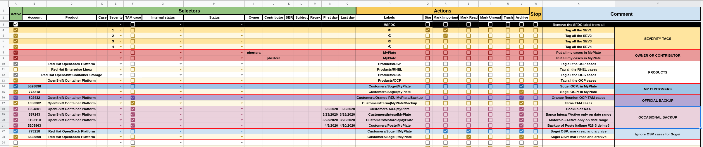

# GSS SFDC filters manager

This tool helps managing and labelling inbound emails from GSS SFDC.

## Installation

1. Copy the [Google Sheet](https://docs.google.com/spreadsheets/d/1prit02jMf8Ojxj-iVJOoBvB4hlwSaq4GC4GTNHa4LkQ/edit#gid=0) in your drive
2. Add your selectors and actions
3. Make sure that the **Main filter** into the **Config** sheet is properly set (see below for more info)
4. To test the rules, make sure to have some email matching the rules and the **Main filter** and then run the script clicking on **GSS SFDC filters -> Run**, this will run the script only one time
5. To permanently install the script click on **GSS SFDC filters -> Install Trigger**, this will make the script running every X minutes defined into the **Poll time** cell of the **Config** sheet

## How it works

This script is a Google app script bound to a Google spreadsheet.
The script creates a new **GSS SFDC filters** menu entry on the Google spreadsheet, this menu will let you run the script just once (via the **Run** action) or install a trigger that automatically run the script every X minutes (X is defined itno the **Poll time** *C2* cell of the *Config* sheet).

When the script runs it looks into all the email matching the **Main filter** criteria, per each message all the filters into the **Filters sheet** are evaluated one by one starting from the fist line.
Emails are checked against the selectors, if **all** the selector are matched, then the defined actions are performed.

If the **Stop** column is flagged the next filters are not evaluated and the we go to the next mail message.

## Filters definition

Every filter is defined in 2 main parts:

- selectors
- actions

Selectors are used to define to which email we want to perfom a defined action.

### Selectors

| Selector Name | Match if ... |
|:-------------:|:-------------------:|
| Product       | ... the email header `X-SFDC-X-Product` **is the same** of the defined value |
| Case          | ... the email header `X-SFDC-X-Case-Number` **is the same** of the defined value |
| Severity      | ... the email header `X-SFDC-X-Severity` **contains** the defined value |
| TAM Case      | ... the email header `X-SFDC-X-TAM-Case` **is** `true` |
| Internal status | ... the email header `X-SFDC-X-Internal-Status` **is the same** of the defined value |
| Status        | ... the email header `X-SFDC-X-Status` **is the same** of the defined value |
| Owner         | ... the email header `X-SFDC-Owner` **contains** the defined value |
| Contributor   | ... the email header `X-SFDC-Contributor` **contains** the defined value |
| SBR           | ... the email header `X-SFDC-X-SBR-Group` **is the same** of the defined value |
| Subject       | ... the email subject **contains** the defined value |
| Regex         | ... the email matches the defined regex |
| First day     | ... the filter is evaluated **during or after** the defined date (hint: double click on the cell to have a date picker) |
| Last day      | ... the filter is evaluated **during or before** the defined date (hint: double click on the cell to have a date picker) |

**NOTE:** First and Last day are compared against the script execution time, not the email delivery time

### Actions

* **Labels:** the defined labels are applied to the mail thread, to nest labels the `/` separator can be used (eg. `Customers/Bank of America`). You can apply multiple labels at once to the thread dividing each label with the separator defined into the cell *D2* of the *Config* sheet (Labels separator). Is also possible to remove a label prefixing the label name with the prefix defined into the cell *E2* of the *Config* sheet, (eg. `!!MyPlate`)
* **Star:** the last mail message of the thread is starred, unfortunately the Google API do not provide any way to apply different start, only the yelow star
* **Mark Important:** the whole mail thread is marked as important
* **Mark Read:** the whole mail thread is marked as read
* **Mark Unread:** the whole mail thread is marked as unread
* **Trash:** move the whole mail thread to the trash
* **Archive:** move the whole mail thread to the archive
* **Stop:** if selectors are matched do not continue evaluating next filters

## Notes

Since Google apps have some API [quota limits](https://developers.google.com/apps-script/guides/services/quotas), the script should process a limited number of emails.
I adopt this approach: I configure my Gmail inbox to apply the label **SFDC** to all the messages coming from **support@redhat.com**, then I set the *Main Filter* (cell *A2* of the *Config* sheet) to **label:sfdc in:inbox**, so the script will parse only a limited number of messages. Then in my ruleset I have that removes the `SFDC` from all the messages so emails will get processed only once.

## How to safely play / test the script

0. Change the `Main Filter` (cell `A2` of the `Config` sheet) to `label:sandbox is:unread`, this will instruct the script to process only the unread messages labelled with `sandbox`
1. Create a Gmail label named `sandbox`
2. Label some messages that you want to use as playground with the `sandbox` label
3. Execute the script

## FAQ

- Q: After installing the scrip I will see new mail filters in my Gmail ?
- A: No, thie script doesn't touch the Gmail filters, just looks at your emails and will perform actions

- Q: Do I need to keep the Google spreadsheet open to make it working ?
- A: No, once is installed will run on the Google cloud

- Q: How can I remove the script ?
- A: You if you installed the trigger you can remove it via the **GSS SFDC filters -> Uninstall Trigger**, using the [Google apps script console](https://script.google.com/) you can check if you still have installed triggers

- Q: I want to modify the script ...
- A: The script code can be modified on the [Google apps script console](https://script.google.com/) (Tools -> Script editor). Of course improvements are more than welcome, please open a PR here. I use [clasp](https://github.com/google/clasp) to keep the code on my PC and sync with git

## Links

- [The post that inspired the idea](https://www.labnol.org/internet/advanced-gmail-filters/4875/)
- [Google apps script reference](https://developers.google.com/apps-script/reference)
- [clasp](https://github.com/google/clasp)
